This diagram shows the detailed cost calculation flow from resource ingestion
through output rendering.

```mermaid
flowchart TD
    Start([User runs finfocus]) --> InputType{Cost Type?}

    InputType -->|Projected| LoadPlan[Load Pulumi Plan JSON]
    InputType -->|Actual| GetParams[Get Time Range & Filters]

    LoadPlan --> ParseJSON[Parse JSON with Ingest]
    ParseJSON --> ExtractResources[Extract Resources]
    ExtractResources --> BuildDescriptors[Build ResourceDescriptors]

    GetParams --> BuildQuery[Build ActualCostRequest]

    BuildDescriptors --> DiscoverPlugins[Registry: Discover Plugins]
    BuildQuery --> DiscoverPlugins

    DiscoverPlugins --> HasPlugins{Plugins<br/>Found?}

    HasPlugins -->|Yes| ConnectPlugins[Connect to Plugins via PluginHost]
    HasPlugins -->|No| LoadSpecs[Load Local YAML Specs]

    ConnectPlugins --> LoopResources[For Each Resource]

    LoopResources --> CheckSupport{Plugin<br/>Supports<br/>Resource?}

    CheckSupport -->|Yes| QueryType{Cost Type?}
    CheckSupport -->|No| NextPlugin{More<br/>Plugins?}

    NextPlugin -->|Yes| LoopResources
    NextPlugin -->|No| LoadSpecs

    QueryType -->|Projected| GetProjected[Plugin: GetProjectedCost]
    QueryType -->|Actual| GetActual[Plugin: GetActualCost]

    GetProjected --> PluginSuccess{Success?}
    GetActual --> PluginSuccess

    PluginSuccess -->|Yes| StoreResult[Store Cost Result]
    PluginSuccess -->|No| RetryOrFallback{Retryable?}

    RetryOrFallback -->|Yes| RetryPlugin[Retry with Backoff]
    RetryOrFallback -->|No| LoadSpecs

    RetryPlugin --> PluginSuccess

    LoadSpecs --> SpecFound{Spec<br/>Exists?}
    SpecFound -->|Yes| CalcFromSpec[Calculate from Spec]
    SpecFound -->|No| UsePlaceholder[Use Placeholder Cost]

    CalcFromSpec --> StoreResult
    UsePlaceholder --> StoreResult

    StoreResult --> MoreResources{More<br/>Resources?}
    MoreResources -->|Yes| LoopResources
    MoreResources -->|No| AggregateCheck{Aggregation<br/>Needed?}

    AggregateCheck -->|Yes| GroupBy{Group By?}
    AggregateCheck -->|No| FormatOutput

    GroupBy -->|Resource| GroupByResource[Group by Resource ID]
    GroupBy -->|Type| GroupByType[Group by Resource Type]
    GroupBy -->|Provider| GroupByProvider[Group by Cloud Provider]
    GroupBy -->|Daily| GroupByDaily[Aggregate by Day]
    GroupBy -->|Monthly| GroupByMonthly[Aggregate by Month]

    GroupByResource --> ValidateCurrency{Same<br/>Currency?}
    GroupByType --> ValidateCurrency
    GroupByProvider --> ValidateCurrency
    GroupByDaily --> ValidateCurrency
    GroupByMonthly --> ValidateCurrency

    ValidateCurrency -->|Yes| ComputeTotals[Compute Totals & Subtotals]
    ValidateCurrency -->|No| CurrencyError[Error: Mixed Currencies]

    ComputeTotals --> FormatOutput[Format Output]

    FormatOutput --> OutputFormat{Output<br/>Format?}

    OutputFormat -->|Table| RenderTable[Render ASCII Table]
    OutputFormat -->|JSON| RenderJSON[Render JSON]
    OutputFormat -->|NDJSON| RenderNDJSON[Render NDJSON]

    RenderTable --> DisplayOutput[Display to User]
    RenderJSON --> DisplayOutput
    RenderNDJSON --> DisplayOutput

    CurrencyError --> DisplayError[Display Error]

    DisplayOutput --> End([Done])
    DisplayError --> End

    classDef inputNode fill:#E3F2FD,stroke:#1976D2
    classDef processNode fill:#C8E6C9,stroke:#388E3C
    classDef decisionNode fill:#FFF9C4,stroke:#F57C00
    classDef errorNode fill:#FFCDD2,stroke:#C62828
    classDef outputNode fill:#E1BEE7,stroke:#7B1FA2

    class Start,LoadPlan,GetParams,DisplayOutput,End inputNode
    class ParseJSON,ExtractResources,BuildDescriptors,BuildQuery processNode
    class DiscoverPlugins,ConnectPlugins,GetProjected,GetActual processNode
    class StoreResult,CalcFromSpec,GroupByResource,GroupByType processNode
    class GroupByProvider,GroupByDaily,GroupByMonthly,ComputeTotals processNode
    class RenderTable,RenderJSON,RenderNDJSON processNode
    class InputType,HasPlugins,CheckSupport,NextPlugin decisionNode
    class QueryType,PluginSuccess,RetryOrFallback,SpecFound decisionNode
    class MoreResources,AggregateCheck,GroupBy decisionNode
    class ValidateCurrency,OutputFormat decisionNode
    class LoadSpecs,UsePlaceholder,RetryPlugin errorNode
    class CurrencyError,DisplayError errorNode
```



## Cost Calculation Stages

### 1. Input Processing

**Projected Cost:**

- Load Pulumi plan JSON file
- Parse with Ingest component
- Extract resource definitions
- Build ResourceDescriptor objects

**Actual Cost:**

- Parse command-line arguments (start date, end date, filters)
- Build ActualCostRequest with time ranges and tag filters

### 2. Plugin Discovery

The Registry scans `~/.finfocus/plugins/` to discover available cost
source plugins. If no plugins are found, the system falls back to local
YAML pricing specifications.

### 3. Plugin Connection

The Plugin Host establishes gRPC connections to discovered plugins. This
involves:

- Launching plugin processes
- Establishing gRPC connections
- Validating plugin availability

### 4. Resource Processing Loop

For each resource in the plan:

**Support Check:** Query plugin if it supports the resource type

**Cost Query:**

- Projected: Call `GetProjectedCost(ResourceDescriptor)`
- Actual: Call `GetActualCost(resourceId, startTime, endTime, tags)`

**Error Handling:**

- Retry transient errors with exponential backoff
- Fall back to local specs for permanent errors
- Use placeholder cost if no spec available

### 5. Aggregation

When grouping is requested, costs are aggregated:

**By Resource:** Sum costs per resource ID

**By Type:** Sum costs per resource type (ec2, s3, etc.)

**By Provider:** Sum costs per cloud provider (aws, azure, gcp)

**By Time:** Aggregate costs by day or month

**Currency Validation:** Ensures all costs use the same currency (USD, EUR)
before aggregation. Mixed currencies trigger an error.

### 6. Output Formatting

The Engine formats results based on the requested output format:

**Table Format:**

- ASCII table with borders
- Aligned columns for resource, type, cost
- Summary row with totals

**JSON Format:**

- Structured JSON array
- Full resource details
- Nested aggregations

**NDJSON Format:**

- Newline-delimited JSON
- One resource per line
- Streaming-friendly format

## Cost Calculation Formulas

### Projected Cost (Monthly)

```text
Monthly Cost = Unit Price × Usage Amount × Hours Per Month

Where:
  Hours Per Month = 730 (standard constant)
  Unit Price = From plugin or spec
  Usage Amount = Resource quantity (instances, GB, etc.)
```

### Actual Cost (Time Range)

```text
Total Cost = Σ (Daily Cost) for date in [start, end]

Daily Cost = From plugin API for specific date
```

### Cross-Provider Aggregation

```text
For each grouping dimension (provider, type, date):
  Subtotal = Σ (Resource Cost) where resource matches dimension
  Total = Σ (Subtotal) across all dimensions
```

## Error Handling Strategy

### Transient Errors

**Examples:** Network timeout, rate limiting, service unavailable

**Handling:**

- Retry up to 3 times with exponential backoff
- Wait intervals: 100ms, 200ms, 400ms

### Permanent Errors

**Examples:** Resource not found, invalid credentials, unsupported region

**Handling:**

- No retry
- Fall back to local specs immediately

### Configuration Errors

**Examples:** Missing API key, invalid endpoint

**Handling:**

- Report to user with clear error message
- Suggest configuration fixes

## Fallback Behavior

When plugins fail or don't support a resource type:

1. **Try local YAML spec:** Load from `~/.finfocus/specs/`
2. **Use spec pricing:** Calculate cost using spec rate_per_unit
3. **Placeholder:** If no spec, return $0.00 with "unknown" source

This ensures the system always produces output, even with incomplete data.

---

**Related Documentation:**

- [System Architecture](system-architecture.md) - Component overview
- [Cost Calculation](../cost-calculation.md) - Detailed algorithms
- [Plugin Protocol](../plugin-protocol.md) - gRPC protocol details
