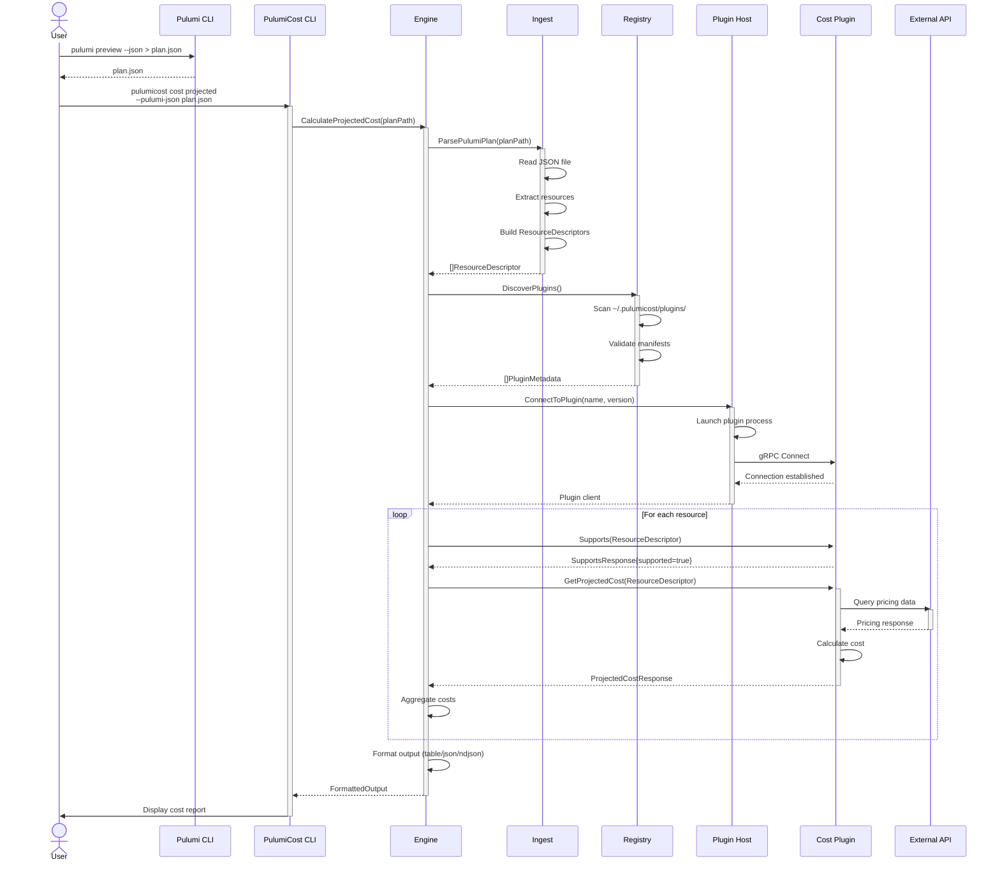
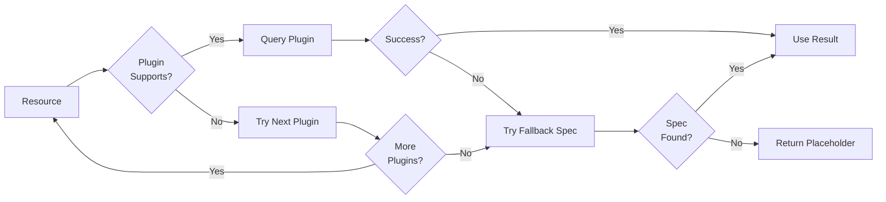

This diagram shows the complete data flow from Pulumi plan generation through
cost calculation and output rendering.



## Data Flow Stages

### 1. Plan Generation

User generates Pulumi infrastructure plan using `pulumi preview --json`,
which outputs resource definitions to a JSON file.

### 2. CLI Invocation

User invokes PulumiCost CLI with the plan file. The CLI parses command-line
arguments and routes the request to the appropriate Engine method.

### 3. Resource Ingestion

The Engine delegates to the Ingest component to parse the Pulumi JSON plan
and convert it into internal ResourceDescriptor objects containing provider,
type, SKU, region, and tags.

### 4. Plugin Discovery

The Engine queries the Registry to discover available cost source plugins by
scanning the plugin directory structure (`~/.pulumicost/plugins/`).

### 5. Plugin Connection

The Engine uses the Plugin Host to establish gRPC connections to discovered
plugins. The Plugin Host launches plugin processes and manages their lifecycle.

### 6. Cost Calculation Loop

For each resource descriptor:

- Engine checks if plugin supports the resource type
- Engine requests cost calculation from plugin
- Plugin queries external API for pricing data
- Plugin performs cost calculations
- Plugin returns cost results to Engine
- Engine aggregates costs across all resources

### 7. Output Formatting

The Engine formats the aggregated cost data according to the user's requested
output format (table, JSON, or NDJSON).

### 8. Result Display

The CLI displays the formatted cost report to the user.

## Data Transformation Pipeline

```text
Pulumi Plan JSON
    ↓
Resource Descriptors (internal/engine types)
    ↓
Plugin gRPC Requests (protobuf)
    ↓
External API Requests (REST/gRPC)
    ↓
External API Responses
    ↓
Plugin gRPC Responses (protobuf)
    ↓
Aggregated Cost Results (internal/engine types)
    ↓
Formatted Output (table/JSON/NDJSON)
```

## Error Handling Flow



## Fallback Strategy

When plugins are unavailable or don't support a resource type, the Engine
falls back to local YAML pricing specifications in `~/.pulumicost/specs/`.
If no spec is found, a placeholder cost is returned to ensure the system
always produces output.

---

**Related Documentation:**

- [System Architecture](system-architecture.md) - Component overview
- [Plugin Protocol](../plugin-protocol.md) - gRPC protocol details
- [Cost Calculation Flow](cost-calculation-flow.md) - Detailed calculation
  logic
