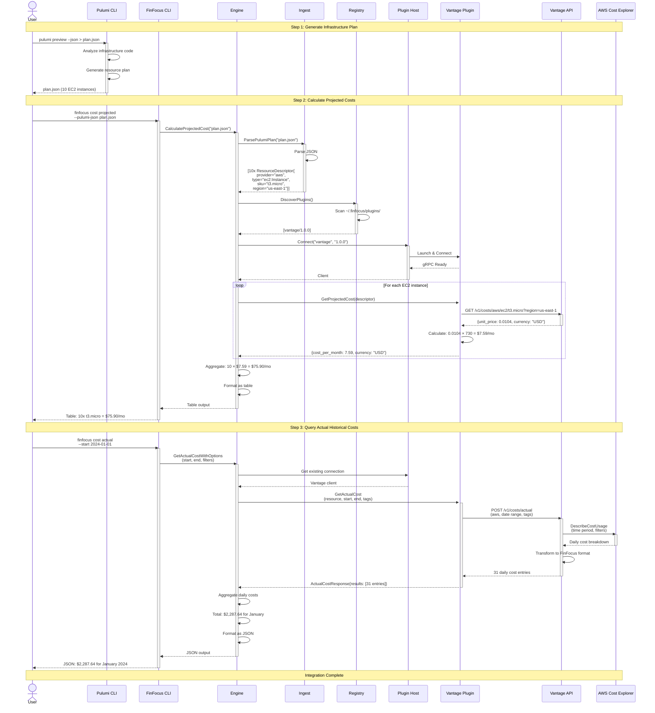

This diagram shows a complete end-to-end integration example using the
Vantage cost source plugin to retrieve actual AWS costs.



## Integration Flow Breakdown

### Step 1: Infrastructure Plan Generation

**User Action:** Runs `pulumi preview --json` to generate infrastructure plan

**Pulumi CLI:**

- Analyzes Pulumi TypeScript/Python/Go code
- Determines resources to be created
- Outputs JSON plan with resource specifications

**Result:** `plan.json` file containing 10 AWS EC2 t3.micro instances

### Step 2: Projected Cost Calculation

**User Action:** Runs `finfocus cost projected --pulumi-json plan.json`

**FinFocus Processing:**

1. **Ingest:** Parses plan.json and extracts ResourceDescriptors
2. **Registry:** Discovers Vantage plugin in `~/.finfocus/plugins/`
3. **Plugin Host:** Launches and connects to Vantage plugin via gRPC
4. **Cost Query:** For each resource, calls `GetProjectedCost()`
5. **Vantage Plugin:** Queries Vantage API for AWS EC2 pricing
6. **Vantage API:** Returns unit price ($0.0104/hour for t3.micro)
7. **Calculation:** 0.0104 × 730 hours/month = $7.59/month per instance
8. **Aggregation:** 10 instances × $7.59 = $75.90/month total
9. **Output:** Formatted ASCII table

**Result:** User sees projected monthly cost of $75.90

### Step 3: Actual Historical Cost Query

**User Action:** Runs `finfocus cost actual` with date range and filters

**FinFocus Processing:**

1. **Engine:** Builds ActualCostRequest with time range and tag filters
2. **Plugin Connection:** Reuses existing Vantage plugin connection
3. **Cost Query:** Calls `GetActualCost()` with parameters
4. **Vantage Plugin:** Queries Vantage API for historical costs
5. **Vantage API:** Calls AWS Cost Explorer API to retrieve actual spend
6. **AWS Response:** Returns daily cost breakdown for January 2024
7. **Transformation:** Vantage formats data to FinFocus proto format
8. **Aggregation:** Engine sums 31 daily costs
9. **Output:** Formatted JSON with total and daily breakdown

**Result:** User sees actual January 2024 cost of $2,287.64

## Data Flow Characteristics

### Request Path

```text
User → CLI → Engine → PluginHost → Plugin → External API → Cloud Provider
```

### Response Path

```text
Cloud Provider → External API → Plugin → Engine → CLI → User
```

### Plugin Communication

**Protocol:** gRPC using protocol buffers from finfocus-spec

**Transport:** TCP sockets (default) or stdio pipes

**Lifecycle:** Plugins persist for multiple requests to reduce startup
overhead

## Vantage Plugin Specifics

### Configuration

Vantage plugin requires API credentials:

```yaml
# ~/.finfocus/config.yaml
integrations:
  vantage:
    api_key: 'vantage_api_key_here'
    endpoint: 'https://api.vantage.sh'
```

### API Endpoints Used

**Projected Cost:**

- `GET /v1/costs/{provider}/{resource_type}/{sku}?region={region}`
- Returns current pricing rates

**Actual Cost:**

- `POST /v1/costs/actual`
- Body: `{provider, start, end, tags, filters}`
- Returns historical cost data

### Error Handling

**Transient Errors:** Retry with exponential backoff (network timeouts, rate
limits)

**Permanent Errors:** Fall back to local specs (resource not found, invalid
credentials)

**Configuration Errors:** Report to user (missing API key, invalid endpoint)

## Real-World Usage Example

### Development Workflow

```bash
# 1. User develops infrastructure in Pulumi
cd my-pulumi-project
pulumi preview --json > plan.json

# 2. Estimate costs before deployment
finfocus cost projected --pulumi-json plan.json
# Output: $75.90/month

# 3. Deploy infrastructure
pulumi up

# 4. After 30 days, check actual costs
finfocus cost actual \
  --start-date 2024-01-01 \
  --end-date 2024-01-31 \
  --filter "tag:project=my-pulumi-project" \
  --output json > actual-costs.json

# 5. Compare projected vs actual
cat actual-costs.json | jq '.total_cost'
# Output: $2,287.64 (30x higher due to additional resources!)
```

### Cost Optimization Loop

1. **Estimate** projected costs using Pulumi plans
2. **Deploy** infrastructure
3. **Monitor** actual costs via FinFocus
4. **Analyze** variance between projected and actual
5. **Optimize** infrastructure based on insights
6. **Repeat** the cycle

---

**Related Documentation:**

- [System Architecture](system-architecture.md) - Component overview
- [Data Flow](data-flow.md) - General data flow patterns
- [Vantage Plugin](../../plugins/vantage/) - Vantage integration details
