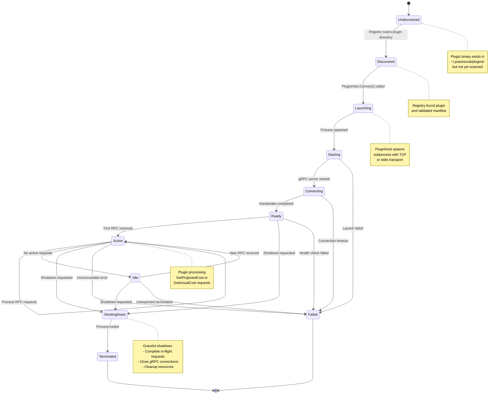

This diagram shows the complete lifecycle of a PulumiCost plugin from
discovery through shutdown.



## Lifecycle Phases

### 1. Undiscovered

Plugin binary exists in the filesystem but has not been detected by the
Registry. This is the initial state for all plugins.

**Location:** `~/.pulumicost/plugins/<name>/<version>/<binary>`

### 2. Discovered

The Registry has scanned the plugin directory, validated the plugin binary,
and optionally loaded the `plugin.manifest.json` metadata file.

**Registry Operations:**

- Scan directory structure
- Check file permissions (Unix) or .exe extension (Windows)
- Load and validate manifest JSON
- Add to available plugins list

### 3. Launching

The Plugin Host initiates plugin process startup. This phase involves:

**Process Launch:**

- Spawn subprocess with appropriate arguments
- Configure transport (TCP port or stdio)
- Set environment variables
- Configure working directory

### 4. Starting

The plugin process is running and initializing its gRPC server.

**Plugin Responsibilities:**

- Initialize gRPC server
- Bind to assigned port (TCP) or stdio
- Load configuration
- Initialize API clients
- Prepare for connections

### 5. Connecting

The Plugin Host attempts to establish a gRPC connection to the plugin.

**Connection Protocol:**

- Retry connection with 100ms delays
- 10-second timeout limit
- Validate gRPC service availability

### 6. Ready

The plugin has successfully connected and is ready to receive requests.

**Validation:**

- gRPC connection established
- Name() RPC succeeds
- Plugin responds to health checks

### 7. Active / Idle

The plugin alternates between Active (processing requests) and Idle (waiting
for requests).

**Active State:** Processing RPC calls (GetProjectedCost, GetActualCost)

**Idle State:** Connected but no active requests

### 8. Shutting Down

Graceful shutdown sequence initiated by the Plugin Host.

**Shutdown Steps:**

1. Stop accepting new requests
2. Complete in-flight requests
3. Close gRPC connections
4. Release API client resources
5. Cleanup temporary files
6. Exit process

### 9. Terminated / Failed

**Terminated:** Normal shutdown completed successfully

**Failed:** Plugin encountered an unrecoverable error

## Error Transitions

Plugins can transition to the Failed state from multiple phases:

- **Launch Failed:** Binary not found, permissions error, port conflict
- **Connection Timeout:** Plugin didn't start gRPC server within 10 seconds
- **Health Check Failed:** Plugin not responding to RPC calls
- **Unrecoverable Error:** Plugin crashed or returned fatal error
- **Unexpected Termination:** Process died without proper shutdown

## Plugin Host Retry Behavior

When a plugin fails, the Plugin Host behavior depends on the error category:

**Transient Errors:**

- Retry connection with exponential backoff
- Maximum 3 retry attempts
- Examples: Network timeout, temporary resource unavailable

**Permanent Errors:**

- No retry, immediately fail
- Examples: Binary not found, invalid manifest, permission denied

**Configuration Errors:**

- No retry, report to user
- Examples: Missing API key, invalid credentials

## Manifest Validation

The Registry validates the plugin manifest during discovery:

```json
{
  "name": "kubecost",
  "version": "1.0.0",
  "protocol_version": "1",
  "executable": "kubecost-plugin",
  "description": "Kubecost cost source plugin"
}
```

**Validation Rules:**

- Name must match directory name
- Version must match directory version
- Executable must exist and be executable
- Protocol version must be compatible

## Platform-Specific Behavior

**Unix/Linux:**

- Plugin binary must have executable permission (`chmod +x`)
- Uses file permissions for validation

**Windows:**

- Plugin binary must have `.exe` extension
- Uses file extension for validation

---

**Related Documentation:**

- [Plugin Protocol](../plugin-protocol.md) - gRPC protocol specification
- [Plugin Host](../../../internal/pluginhost/CLAUDE.md) - Implementation
  details
- [Registry](../../../internal/registry/CLAUDE.md) - Discovery implementation
