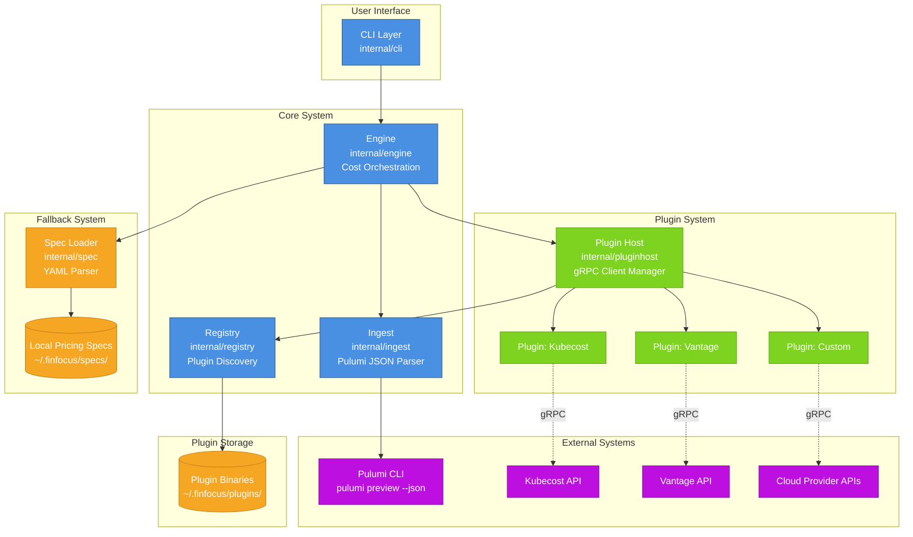

This diagram shows the high-level architecture of FinFocus, including all
major components and their relationships.

## Component Overview

### User Interface Layer

- **CLI Layer** (`internal/cli`) - Cobra-based command-line interface
  providing subcommands for cost operations and plugin management

### Core System Components

- **Engine** (`internal/engine`) - Orchestrates cost calculations, coordinates
  between plugins and specs, handles output formatting
- **Ingest** (`internal/ingest`) - Parses Pulumi JSON output and converts to
  resource descriptors
- **Registry** (`internal/registry`) - Discovers and manages plugin lifecycle
  from filesystem

### Plugin System

- **Plugin Host** (`internal/pluginhost`) - Manages gRPC connections to
  plugins, handles process lifecycle
- **Plugins** - External cost source integrations (Kubecost, Vantage, custom
  implementations)

### Fallback System

- **Spec Loader** (`internal/spec`) - Loads local YAML pricing specifications
  when plugins unavailable
- **Spec Files** - Local YAML-based pricing data stored in user's home
  directory

### External Systems

- **Pulumi CLI** - Generates infrastructure plan JSON via
  `pulumi preview --json`
- **Cost Source APIs** - External APIs (Kubecost, Vantage, cloud providers)
  queried by plugins

## Communication Patterns

- **Solid lines** - Direct function calls and synchronous communication
- **Dotted lines** - gRPC network communication with external APIs
- **Storage cylinders** - Filesystem-based data sources

## Design Patterns

- **Plugin Architecture** - Extensible via external gRPC plugins
- **Fallback Pattern** - Local specs used when plugins unavailable
- **Registry Pattern** - Dynamic plugin discovery from filesystem
- **Adapter Pattern** - Engine adapts between CLI, plugins, and specs

---

**Related Documentation:**

- [System Overview](../system-overview.md) - Detailed architecture explanation
- [Plugin Protocol](../plugin-protocol.md) - gRPC protocol specification
- [Data Flow](data-flow.md) - How data flows through the system
