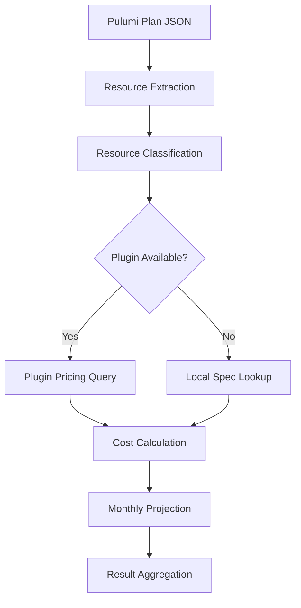
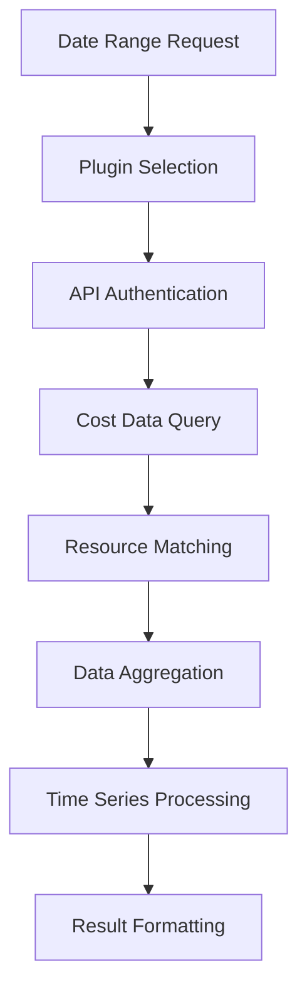

# Cost Calculations Guide

Deep dive into how FinFocus Core calculates projected and actual infrastructure costs.

## Table of Contents

- [Overview](#overview)
- [Projected Cost Calculations](#projected-cost-calculations)
- [Actual Cost Calculations](#actual-cost-calculations)
- [Cost Methodologies](#cost-methodologies)
- [Data Sources](#data-sources)
- [Aggregation and Grouping](#aggregation-and-grouping)
- [Accuracy and Limitations](#accuracy-and-limitations)
- [Best Practices](#best-practices)

## Overview

FinFocus Core provides two types of cost analysis:

- **Projected Costs**: Estimates based on resource specifications and pricing data
- **Actual Costs**: Historical spending retrieved from cloud provider APIs

Understanding how these calculations work helps you interpret results and optimize your infrastructure costs.

## Projected Cost Calculations

Projected costs estimate monthly spending based on resource configurations and pricing specifications.

### Calculation Flow



### Resource Classification

Resources are classified by type and provider:

```json
{
  "type": "aws:ec2/instance:Instance",
  "provider": "aws",
  "service": "ec2",
  "resourceType": "instance"
}
```

### Pricing Sources (Priority Order)

1. **Plugin Data**: Live pricing from cloud provider APIs
2. **Local Specs**: YAML/JSON pricing specifications
3. **Fallback Estimates**: Default values by resource category

### Monthly Calculation Formula

```text
Monthly Cost = Hourly Rate × Hours Per Month (730)
```

**Constants used:**

- Hours per month: 730 (average accounting for varying month lengths)
- Hours per day: 24
- Days per month: 30.42 (average)

### Example Calculation

**AWS EC2 t3.micro instance:**

```yaml
# Pricing spec
pricing:
  onDemandHourly: 0.0104

# Calculation
Monthly Cost = 0.0104 × 730 = $7.59
```

### Resource-Specific Calculations

#### Compute Resources

- **EC2 Instances**: Based on instance type, region, and pricing model
- **ECS Tasks**: vCPU and memory allocation with Fargate pricing
- **Lambda Functions**: Execution time and memory allocation

#### Storage Resources

- **S3 Buckets**: Storage class, region, and estimated data volume
- **EBS Volumes**: Volume type, size, and IOPS provisioning
- **EFS File Systems**: Storage class and throughput mode

#### Database Resources

- **RDS Instances**: Engine type, instance class, and storage
- **DynamoDB Tables**: Provisioned vs on-demand, read/write capacity
- **DocumentDB Clusters**: Instance type and storage requirements

#### Network Resources

- **Load Balancers**: Type (ALB/NLB/CLB) and estimated data transfer
- **NAT Gateways**: Data processing charges
- **VPC Endpoints**: Interface vs Gateway endpoints

### Fallback Pricing

When specific pricing is unavailable, default estimates are used:

```go
const (
    defaultDatabaseMonthlyCost = 50.0   // Database resources
    defaultStorageMonthlyCost = 5.0     // Storage resources
    defaultComputeMonthlyCost = 20.0    // Compute resources
)
```

## Actual Cost Calculations

Actual costs retrieve historical spending data from cloud provider billing APIs through plugins.

### Data Retrieval Flow



### Time Range Processing

#### Date Format Support

- **Simple dates**: `2025-01-01` (assumes start/end of day)
- **RFC3339**: `2025-01-01T14:30:00Z` (precise timestamps)
- **Partial timestamps**: `2025-01-01T14:30:00Z` (timezone aware)

#### Time Zone Handling

- All times converted to UTC for consistency
- Plugin APIs may return data in different time zones
- Results always include timezone information

### Resource Matching

Resources from Pulumi plans are matched to cost data using:

1. **Resource ARN/ID**: Direct matching where available
2. **Resource Tags**: Tag-based identification
3. **Resource Type**: Service and type matching
4. **Fuzzy Matching**: Heuristic matching based on properties

### Aggregation Methods

#### By Time Period

```json
{
  "dailyCosts": [12.45, 13.67, 11.23, ...],
  "totalCost": 156.78,
  "costPeriod": "2025-01-01 to 2025-01-31"
}
```

#### By Resource

```json
{
  "resourceType": "aws:ec2/instance:Instance",
  "resourceId": "web-server",
  "totalCost": 89.45
}
```

#### By Service/Provider

```json
{
  "summary": {
    "byProvider": { "aws": 156.78 },
    "byService": { "ec2": 89.45, "s3": 23.12, "rds": 44.21 }
  }
}
```

## Cost Methodologies

### Projected vs Actual Cost Differences

| Aspect          | Projected Costs         | Actual Costs             |
| --------------- | ----------------------- | ------------------------ |
| **Data Source** | Pricing specifications  | Billing APIs             |
| **Timing**      | Pre-deployment          | Post-deployment          |
| **Accuracy**    | Estimates               | Actual spending          |
| **Variability** | Static pricing          | Usage-based fluctuations |
| **Scope**       | Resource configurations | Realized consumption     |

### Common Discrepancies

#### Usage Patterns

- **Projected**: Assumes 100% uptime (730 hours/month)
- **Actual**: Reflects real usage patterns, scaling, downtime

#### Pricing Models

- **Projected**: Often uses on-demand pricing
- **Actual**: Includes reserved instances, spot instances, savings plans

#### Additional Services

- **Projected**: Only explicitly defined resources
- **Actual**: Includes data transfer, API calls, storage I/O

### Accuracy Factors

#### High Accuracy Scenarios

- Well-defined resource specifications
- Stable usage patterns
- On-demand pricing models
- Simple resource configurations

#### Lower Accuracy Scenarios

- Auto-scaling configurations
- Complex data transfer patterns
- Reserved instance utilization
- Multi-service dependencies

## Data Sources

### Plugin-Based Data Sources

#### Kubecost Plugin

- **Source**: Kubecost API
- **Coverage**: Kubernetes workloads, container costs
- **Granularity**: Pod, namespace, cluster level
- **Update Frequency**: Near real-time

#### AWS Cost Explorer Plugin

- **Source**: AWS Cost Explorer API
- **Coverage**: All AWS services
- **Granularity**: Resource, service, account level
- **Update Frequency**: Daily (24-hour delay)

#### Cloud Provider Plugins

- **Azure Cost Management**: Azure spending data
- **GCP Cloud Billing**: Google Cloud costs
- **Multi-cloud**: Aggregated cross-cloud costs

### Local Pricing Specifications

#### Format Example

```yaml
provider: aws
service: ec2
sku: t3.micro
currency: USD
pricing:
  instanceType: t3.micro
  onDemandHourly: 0.0104
  reservedHourly: 0.0074
  spotHourly: 0.0031
  monthlyEstimate: 7.59
metadata:
  region: us-west-2
  operatingSystem: linux
  tenancy: shared
  vcpu: 2
  memory: 1
```

#### Spec Discovery

1. Check `~/.finfocus/specs/` directory
2. Match by provider, service, and SKU
3. Fallback to generic service pricing
4. Use default estimates if no match found

## Aggregation and Grouping

### Grouping Options

#### By Resource (`group-by resource`)

```json
{
  "resourceType": "aws:ec2/instance:Instance",
  "resourceId": "web-server-1",
  "totalCost": 45.67
}
```

#### By Type (`group-by type`)

```json
{
  "groupKey": "aws:ec2/instance:Instance",
  "totalCost": 134.56,
  "resourceCount": 3
}
```

#### By Provider (`group-by provider`)

```json
{
  "groupKey": "aws",
  "totalCost": 456.78,
  "services": ["ec2", "s3", "rds"]
}
```

#### By Date (`group-by date`)

```json
{
  "date": "2025-01-15",
  "totalCost": 15.67,
  "resources": [...]
}
```

#### By Tags (`group-by tag:key=value`)

```json
{
  "tagKey": "Environment",
  "tagValue": "production",
  "totalCost": 234.56,
  "matchedResources": 12
}
```

### Summary Calculations

#### Cost Summary Structure

```json
{
  "summary": {
    "totalMonthly": 456.78,
    "totalHourly": 0.626,
    "currency": "USD",
    "byProvider": { "aws": 456.78 },
    "byService": { "ec2": 234.56, "s3": 78.9, "rds": 143.32 },
    "byAdapter": { "kubecost": 234.56, "aws-spec": 222.22 }
  }
}
```

#### Aggregation Rules

- **Sum**: Total costs across resources
- **Average**: For rate-based metrics
- **Count**: Number of resources in group
- **Currency**: Unified to single currency (USD default)

## Accuracy and Limitations

### Projected Cost Limitations

#### Pricing Data Freshness

- Local specs may be outdated
- Regional pricing variations
- Promotional pricing not reflected

#### Usage Assumptions

- Assumes consistent 24/7 operation
- No auto-scaling considerations
- Static resource configurations

#### Missing Costs

- Data transfer charges
- API request costs
- Third-party service integrations

### Actual Cost Limitations

#### Data Lag

- Billing APIs have 12-48 hour delays
- Real-time costs not available
- Processing time for complex queries

#### Attribution Challenges

- Resource tagging inconsistencies
- Shared resource costs
- Multi-account cost allocation

#### Plugin Dependencies

- Requires plugin installation and configuration
- API rate limits and authentication
- Network connectivity requirements

### Improving Accuracy

#### For Projected Costs

1. **Keep specs updated**: Regularly update pricing specifications
2. **Use plugins**: Leverage live pricing APIs when available
3. **Include usage patterns**: Account for auto-scaling and variable usage
4. **Regional awareness**: Use region-specific pricing

#### For Actual Costs

1. **Consistent tagging**: Implement comprehensive resource tagging
2. **Regular reconciliation**: Compare projected vs actual regularly
3. **Multiple data sources**: Use multiple plugins for validation
4. **Time range considerations**: Allow for billing data processing delays

## Best Practices

### Cost Estimation Workflow

1. **Generate Projections**: Start with projected cost estimates
2. **Deploy and Monitor**: Track actual costs post-deployment
3. **Compare and Analyze**: Identify discrepancies and patterns
4. **Optimize and Iterate**: Adjust resources based on findings

### Tagging Strategy

Implement consistent tagging for accurate cost attribution:

```typescript
// Example Pulumi resource with comprehensive tags
const webServer = new aws.ec2.Instance('web-server', {
  instanceType: 't3.micro',
  tags: {
    Environment: 'production',
    Team: 'backend',
    Project: 'web-app',
    CostCenter: 'engineering',
    Application: 'api-server',
    Owner: 'team@company.com',
  },
});
```

### Regular Validation

```bash
# Monthly cost validation workflow
finfocus cost projected --pulumi-json plan.json --output json > projected.json
finfocus cost actual --pulumi-json plan.json --from $(date -d '1 month ago' +%Y-%m-01) --output json > actual.json

# Compare results
jq -r '.summary.totalMonthly' projected.json
jq -r '.summary.totalMonthly' actual.json
```

### Cost Optimization

#### Identify High-Cost Resources

```bash
# Find most expensive resources
finfocus cost actual --pulumi-json plan.json --from 2025-01-01 --output json | \
  jq '.resources | sort_by(.totalCost) | reverse | .[0:5]'
```

#### Track Cost Trends

```bash
# Generate daily cost trend
for day in {01..31}; do
  finfocus cost actual --pulumi-json plan.json --from 2025-01-$day --to 2025-01-$day --output json | \
    jq -r "[\"2025-01-$day\", .summary.totalMonthly] | @csv"
done > cost-trend.csv
```

## Related Documentation

- [User Guide](user-guide.md) - Complete usage instructions
- [Plugin System](plugin-system.md) - Plugin development and configuration
- [Troubleshooting](troubleshooting.md) - Common issues and solutions
- [Examples](../examples/) - Sample pricing specs and configurations
