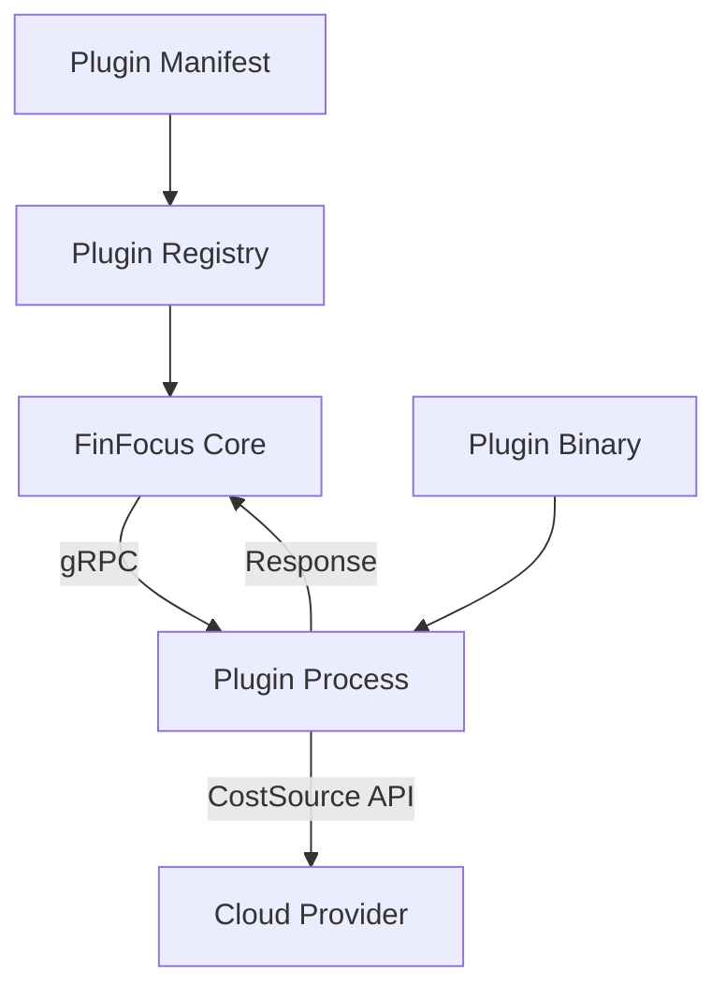

# Plugin System Guide

Comprehensive guide to the FinFocus plugin architecture, management, and development.

## Table of Contents

- [Overview](#overview)
- [Plugin Architecture](#plugin-architecture)
- [Plugin Management](#plugin-management)
- [Available Plugins](#available-plugins)
- [Plugin Development](#plugin-development)
- [Configuration](#configuration)
- [Troubleshooting](#troubleshooting)

## Overview

FinFocus Core uses a plugin-based architecture to fetch cost data from various
sources. Plugins are standalone binaries that implement the CostSource gRPC
service, allowing extensible integration with cloud providers and cost
management platforms.

### Key Benefits

- **Extensibility**: Support for new cost data sources without core changes
- **Modularity**: Independent plugin development and deployment
- **Flexibility**: Multiple cost data sources for validation and accuracy
- **Maintainability**: Plugin-specific logic separated from core functionality

## Plugin Architecture

### Communication Protocol

Plugins communicate with FinFocus Core via gRPC using the
[finfocus-spec](https://github.com/rshade/finfocus-spec) protocol
definitions.



### Plugin Lifecycle

1. **Discovery**: Registry scans `~/.finfocus/plugins/` directory and selects the
   latest version of each plugin (using Semantic Versioning).
2. **Launch**: Process launcher starts plugin binary
3. **Connection**: gRPC connection establishment
4. **Authentication**: Plugin authenticates with data source
5. **Query**: Cost data requests and responses
6. **Cleanup**: Process termination and resource cleanup

### Directory Structure

```text
~/.finfocus/plugins/
├── kubecost/
│   └── 1.0.0/
│       ├── finfocus-kubecost          # Plugin binary
│       └── plugin.manifest.json        # Optional manifest
├── aws-plugin/
│   └── 0.1.0/
│       ├── finfocus-aws
│       └── plugin.manifest.json
└── custom-plugin/
    └── 0.2.0/
        └── finfocus-custom
```

## Plugin Management

### Plugin Versioning

FinFocus Core supports side-by-side installation of multiple plugin versions.
When performing cost analysis or other operations, the system automatically selects
the **latest version** of each installed plugin based on Semantic Versioning (SemVer)
rules.

- **Pre-release versions** (e.g., `v1.0.0-alpha`) are ignored if a stable version (e.g., `v1.0.0`) is present.
- **Invalid versions** are skipped with a warning.
- **Corrupted directories** are skipped with a warning.

To use a specific older version, you must currently uninstall newer versions or use a custom plugin directory.

### List Available Plugins

```bash
# List all discovered plugins
finfocus plugin list
```

**Sample Output:**

```text
NAME        VERSION  STATUS    SUPPORTS                    BINARY
kubecost    1.0.0    ready     projected,actual           finfocus-kubecost
aws-plugin  0.1.0    ready     projected                  finfocus-aws
azure-cost  0.2.0    error     -                          finfocus-azure
```

### Validate Plugin Installation

```bash
# Validate all plugins
finfocus plugin validate

# Validate specific plugin
finfocus plugin validate --adapter kubecost
```

**Validation Checks:**

- Binary exists and is executable
- Plugin responds to gRPC health checks
- Required capabilities are supported
- Authentication configuration is valid

### Plugin Installation

#### Manual Installation

```bash
# Create plugin directory
mkdir -p ~/.finfocus/plugins/kubecost/1.0.0/

# Download and install plugin binary
curl -L https://github.com/rshade/finfocus-plugin-kubecost/releases/latest/download/finfocus-kubecost-linux-amd64 \
  -o ~/.finfocus/plugins/kubecost/1.0.0/finfocus-kubecost

# Make executable
chmod +x ~/.finfocus/plugins/kubecost/1.0.0/finfocus-kubecost

# Optional: Create manifest
cat > ~/.finfocus/plugins/kubecost/1.0.0/plugin.manifest.json << EOF
{
  "name": "kubecost",
  "version": "1.0.0",
  "binary": "finfocus-kubecost",
  "supports": ["projected_cost", "actual_cost"],
  "description": "Kubecost integration for Kubernetes cost analysis"
}
EOF
```

#### Package Manager Installation (Future)

```bash
# Coming soon
finfocus plugin install kubecost@1.0.0
finfocus plugin install aws-plugin@latest
```

### Plugin Configuration

#### Environment Variables

Most plugins use environment variables for configuration:

```bash
# Kubecost plugin configuration
export KUBECOST_API_URL="http://kubecost.example.com:9090"
export KUBECOST_API_TOKEN="your-api-token"

# AWS plugin configuration
export AWS_ACCESS_KEY_ID="your-access-key"
export AWS_SECRET_ACCESS_KEY="your-secret-key"
export AWS_REGION="us-west-2"

# Azure plugin configuration
export AZURE_CLIENT_ID="your-client-id"
export AZURE_CLIENT_SECRET="your-client-secret"
export AZURE_TENANT_ID="your-tenant-id"
```

#### Configuration Files

Some plugins support configuration files:

```yaml
# ~/.finfocus/plugins/kubecost/1.0.0/config.yaml
api_url: 'http://kubecost.example.com:9090'
api_token: 'your-api-token'
timeout: 30s
retry_attempts: 3
clusters:
  - name: 'production'
    context: 'prod-k8s'
  - name: 'staging'
    context: 'staging-k8s'
```

## Available Plugins

### Kubecost Plugin

**Repository**: [finfocus-plugin-kubecost](https://github.com/rshade/finfocus-plugin-kubecost)

**Capabilities:**

- Actual cost data from Kubecost API
- Kubernetes workload cost attribution
- Pod, namespace, and cluster-level costs
- Multi-cluster support

**Configuration:**

```bash
export KUBECOST_API_URL="http://kubecost.example.com:9090"
export KUBECOST_API_TOKEN="optional-api-token"
```

**Usage:**

```bash
finfocus cost actual --pulumi-json plan.json --from 2025-01-01 --adapter kubecost
```

### AWS Pricing Plugin

**Repository**: [finfocus-plugin-aws](https://github.com/rshade/finfocus-plugin-aws) (planned)

**Capabilities:**

- AWS Cost Explorer integration
- EC2, RDS, S3 pricing data
- Reserved instance optimization
- Multi-account cost aggregation

**Configuration:**

```bash
export AWS_ACCESS_KEY_ID="your-access-key"
export AWS_SECRET_ACCESS_KEY="your-secret-key"
export AWS_REGION="us-west-2"
```

### Azure Cost Management Plugin

**Repository**: [finfocus-plugin-azure](https://github.com/rshade/finfocus-plugin-azure) (planned)

**Capabilities:**

- Azure Cost Management API integration
- Resource group cost breakdown
- Azure subscription analysis
- Reserved instance tracking

### GCP Cloud Billing Plugin

**Repository**: [finfocus-plugin-gcp](https://github.com/rshade/finfocus-plugin-gcp) (planned)

**Capabilities:**

- Google Cloud Billing API integration
- Project and folder cost attribution
- Committed use discount tracking
- BigQuery cost analysis

## Plugin Development

### Getting Started

#### Prerequisites

- **Go**: Version 1.25.5 or later
- **Protocol Buffers**: For gRPC service definitions
- **finfocus-spec**: Protocol definitions repository

#### Project Setup

```bash
# Create new plugin project
mkdir finfocus-plugin-mycloud
cd finfocus-plugin-mycloud

# Initialize Go module
go mod init github.com/yourusername/finfocus-plugin-mycloud

# Add finfocus-spec dependency
go get github.com/rshade/finfocus-spec/sdk/go@latest
```

### Implementation Guide

#### 1. Implement CostSource Interface

```go
package main

import (
    "context"
    "fmt"

    pb "github.com/rshade/finfocus-spec/sdk/go/proto/finfocus/v1"
    "google.golang.org/grpc"
)

type MyCloudPlugin struct {
    pb.UnimplementedCostSourceServiceServer
    client *MyCloudClient  // Your cloud provider client
}

func (p *MyCloudPlugin) Name(ctx context.Context, req *pb.NameRequest) (*pb.NameResponse, error) {
    return &pb.NameResponse{
        Name: "mycloud",
        Version: "1.0.0",
    }, nil
}

func (p *MyCloudPlugin) GetProjectedCost(ctx context.Context, req *pb.GetProjectedCostRequest) (*pb.GetProjectedCostResponse, error) {
    // Implement projected cost logic
    resources := req.GetResources()
    var costItems []*pb.CostItem

    for _, resource := range resources {
        cost, err := p.calculateProjectedCost(resource)
        if err != nil {
            continue // Skip resources we can't price
        }

        costItems = append(costItems, &pb.CostItem{
            ResourceId: resource.GetId(),
            ResourceType: resource.GetType(),
            MonthlyCost: cost.Monthly,
            HourlyCost: cost.Hourly,
            Currency: "USD",
            Notes: cost.Notes,
        })
    }

    return &pb.GetProjectedCostResponse{
        CostItems: costItems,
    }, nil
}

func (p *MyCloudPlugin) GetActualCost(ctx context.Context, req *pb.GetActualCostRequest) (*pb.GetActualCostResponse, error) {
    // Implement actual cost logic
    resources := req.GetResources()
    fromTime := req.GetFromTime().AsTime()
    toTime := req.GetToTime().AsTime()

    var costItems []*pb.CostItem

    for _, resource := range resources {
        cost, err := p.getActualCost(resource, fromTime, toTime)
        if err != nil {
            continue
        }

        costItems = append(costItems, &pb.CostItem{
            ResourceId: resource.GetId(),
            ResourceType: resource.GetType(),
            TotalCost: cost.Total,
            Currency: "USD",
            StartTime: req.GetFromTime(),
            EndTime: req.GetToTime(),
            DailyCosts: cost.Daily,
        })
    }

    return &pb.GetActualCostResponse{
        CostItems: costItems,
    }, nil
}
```

#### 2. Implement Main Function

```go
func main() {
    // Create gRPC server
    lis, err := net.Listen("tcp", ":0") // Random available port
    if err != nil {
        log.Fatalf("Failed to listen: %v", err)
    }

    // Print the port for FinFocus Core to connect to
    addr := lis.Addr().(*net.TCPAddr)
    fmt.Printf("PLUGIN_PORT=%d\n", addr.Port)

    // Create and register plugin
    s := grpc.NewServer()
    plugin := &MyCloudPlugin{
        client: NewMyCloudClient(), // Initialize your API client
    }

    pb.RegisterCostSourceServiceServer(s, plugin)

    // Start serving
    log.Printf("Plugin serving on port %d", addr.Port)
    if err := s.Serve(lis); err != nil {
        log.Fatalf("Failed to serve: %v", err)
    }
}
```

#### 3. Resource Mapping

```go
func (p *MyCloudPlugin) calculateProjectedCost(resource *pb.ResourceDescriptor) (*Cost, error) {
    // Map Pulumi resource types to cloud provider services
    switch resource.GetType() {
    case "mycloud:compute/instance:Instance":
        return p.getComputeCost(resource)
    case "mycloud:storage/bucket:Bucket":
        return p.getStorageCost(resource)
    case "mycloud:database/cluster:Cluster":
        return p.getDatabaseCost(resource)
    default:
        return nil, fmt.Errorf("unsupported resource type: %s", resource.GetType())
    }
}

func (p *MyCloudPlugin) getComputeCost(resource *pb.ResourceDescriptor) (*Cost, error) {
    // Extract instance size from resource properties
    properties := resource.GetProperties()
    instanceSize := properties["instanceSize"]

    // Query pricing API
    pricing, err := p.client.GetInstancePricing(instanceSize)
    if err != nil {
        return nil, err
    }

    return &Cost{
        Hourly:  pricing.HourlyRate,
        Monthly: pricing.HourlyRate * 730, // 730 hours per month
        Notes:   fmt.Sprintf("%s on-demand pricing", instanceSize),
    }, nil
}
```

### Plugin Testing

#### Unit Testing

```go
func TestMyCloudPlugin(t *testing.T) {
    plugin := &MyCloudPlugin{
        client: &MockMyCloudClient{}, // Mock client for testing
    }

    req := &pb.GetProjectedCostRequest{
        Resources: []*pb.ResourceDescriptor{
            {
                Id:   "test-instance",
                Type: "mycloud:compute/instance:Instance",
                Properties: map[string]string{
                    "instanceSize": "medium",
                },
            },
        },
    }

    resp, err := plugin.GetProjectedCost(context.Background(), req)
    assert.NoError(t, err)
    assert.Len(t, resp.CostItems, 1)
    assert.Equal(t, "test-instance", resp.CostItems[0].ResourceId)
}
```

#### Integration Testing

```bash
# Build plugin
go build -o finfocus-mycloud

# Test with FinFocus Core
mkdir -p ~/.finfocus/plugins/mycloud/1.0.0/
cp finfocus-mycloud ~/.finfocus/plugins/mycloud/1.0.0/

# Validate plugin
finfocus plugin validate --adapter mycloud

# Test cost calculation
finfocus cost projected --pulumi-json test-plan.json --adapter mycloud
```

### Building and Distribution

#### Cross-Platform Builds

```bash
# Build for multiple platforms
GOOS=linux GOARCH=amd64 go build -o finfocus-mycloud-linux-amd64
GOOS=darwin GOARCH=amd64 go build -o finfocus-mycloud-darwin-amd64
GOOS=windows GOARCH=amd64 go build -o finfocus-mycloud-windows-amd64.exe
```

#### GitHub Releases

```yaml
# .github/workflows/release.yml
name: Release
on:
  push:
    tags: ['v*']
jobs:
  release:
    runs-on: ubuntu-latest
    steps:
      - uses: actions/checkout@v4
      - uses: actions/setup-go@v5
        with:
          go-version: '1.25.5'

      - name: Build binaries
        run: |
          GOOS=linux GOARCH=amd64 go build -o finfocus-mycloud-linux-amd64
          GOOS=darwin GOARCH=amd64 go build -o finfocus-mycloud-darwin-amd64
          GOOS=windows GOARCH=amd64 go build -o finfocus-mycloud-windows-amd64.exe

      - name: Create release
        uses: softprops/action-gh-release@v2
        with:
          files: |
            finfocus-mycloud-*
```

## Configuration

### Plugin Manifest

Optional `plugin.manifest.json` file provides metadata:

```json
{
  "name": "mycloud",
  "version": "1.0.0",
  "description": "MyCloud cost integration plugin",
  "binary": "finfocus-mycloud",
  "supports": ["projected_cost", "actual_cost"],
  "author": "Your Name",
  "homepage": "https://github.com/yourusername/finfocus-plugin-mycloud",
  "config": {
    "required_env": ["MYCLOUD_API_KEY"],
    "optional_env": ["MYCLOUD_REGION", "MYCLOUD_TIMEOUT"],
    "config_file": "config.yaml"
  }
}
```

### Authentication

#### Environment Variables (Recommended)

```bash
export MYCLOUD_API_KEY="your-api-key"
export MYCLOUD_API_SECRET="your-api-secret"
export MYCLOUD_REGION="us-west-2"
```

#### Configuration Files

```yaml
# ~/.finfocus/plugins/mycloud/1.0.0/config.yaml
api:
  key: 'your-api-key'
  secret: 'your-api-secret'
  endpoint: 'https://api.mycloud.com'
  timeout: 30s

regions:
  - 'us-west-2'
  - 'us-east-1'

cache:
  enabled: true
  ttl: '1h'
```

#### Credential Providers

```go
// Support multiple credential sources
type CredentialProvider interface {
    GetCredentials(ctx context.Context) (*Credentials, error)
}

// Environment variable provider
type EnvCredentialProvider struct{}

func (p *EnvCredentialProvider) GetCredentials(ctx context.Context) (*Credentials, error) {
    return &Credentials{
        APIKey:    os.Getenv("MYCLOUD_API_KEY"),
        APISecret: os.Getenv("MYCLOUD_API_SECRET"),
        Region:    os.Getenv("MYCLOUD_REGION"),
    }, nil
}

// Configuration file provider
type FileCredentialProvider struct {
    ConfigPath string
}

func (p *FileCredentialProvider) GetCredentials(ctx context.Context) (*Credentials, error) {
    // Load from config file
    config, err := loadConfigFile(p.ConfigPath)
    if err != nil {
        return nil, err
    }

    return &Credentials{
        APIKey:    config.API.Key,
        APISecret: config.API.Secret,
        Region:    config.API.Region,
    }, nil
}
```

## Troubleshooting

### Common Plugin Issues

#### Plugin Not Found

```bash
# Check plugin directory structure
ls -la ~/.finfocus/plugins/

# Verify binary exists and is executable
ls -la ~/.finfocus/plugins/*/*/finfocus-*
chmod +x ~/.finfocus/plugins/*/*/finfocus-*
```

#### Connection Failures

```bash
# Test plugin directly
~/.finfocus/plugins/kubecost/1.0.0/finfocus-kubecost

# Check network connectivity
curl -v http://kubecost.example.com:9090/api/v1/costDataModel

# Verify authentication
export KUBECOST_API_TOKEN="test-token"
finfocus plugin validate --adapter kubecost
```

#### Authentication Issues

```bash
# Check environment variables
env | grep -E "(AWS|AZURE|GCP|KUBECOST)"

# Test API access
curl -H "Authorization: Bearer $API_TOKEN" https://api.provider.com/test

# Review plugin logs
finfocus --debug cost actual --adapter kubecost --from 2025-01-01
```

### Debug Mode

```bash
# Enable debug logging
finfocus --debug plugin validate

# Plugin-specific debugging
export PLUGIN_DEBUG=1
export PLUGIN_LOG_LEVEL=debug
finfocus cost actual --adapter kubecost --from 2025-01-01
```

### Plugin Development Debugging

```go
// Add logging to plugin
import "log"

func (p *MyCloudPlugin) GetProjectedCost(ctx context.Context, req *pb.GetProjectedCostRequest) (*pb.GetProjectedCostResponse, error) {
    log.Printf("GetProjectedCost called with %d resources", len(req.GetResources()))

    for _, resource := range req.GetResources() {
        log.Printf("Processing resource: %s (%s)", resource.GetId(), resource.GetType())
    }

    // ... implementation
}
```

## Related Documentation

- [User Guide](user-guide.md) - Using plugins for cost analysis
- [Cost Calculations](cost-calculations.md) - Understanding cost methodologies
- [Installation](installation.md) - Setting up plugins
- [Troubleshooting](troubleshooting.md) - Common issues and solutions

## Community Plugins

### Contributing a Plugin

1. Implement the CostSource interface
2. Add comprehensive tests
3. Create documentation
4. Submit to plugin registry (coming soon)

### Plugin Registry (Future)

```bash
# Search available plugins
finfocus plugin search aws

# Install from registry
finfocus plugin install kubecost@1.0.0

# Update plugins
finfocus plugin update --all
```
