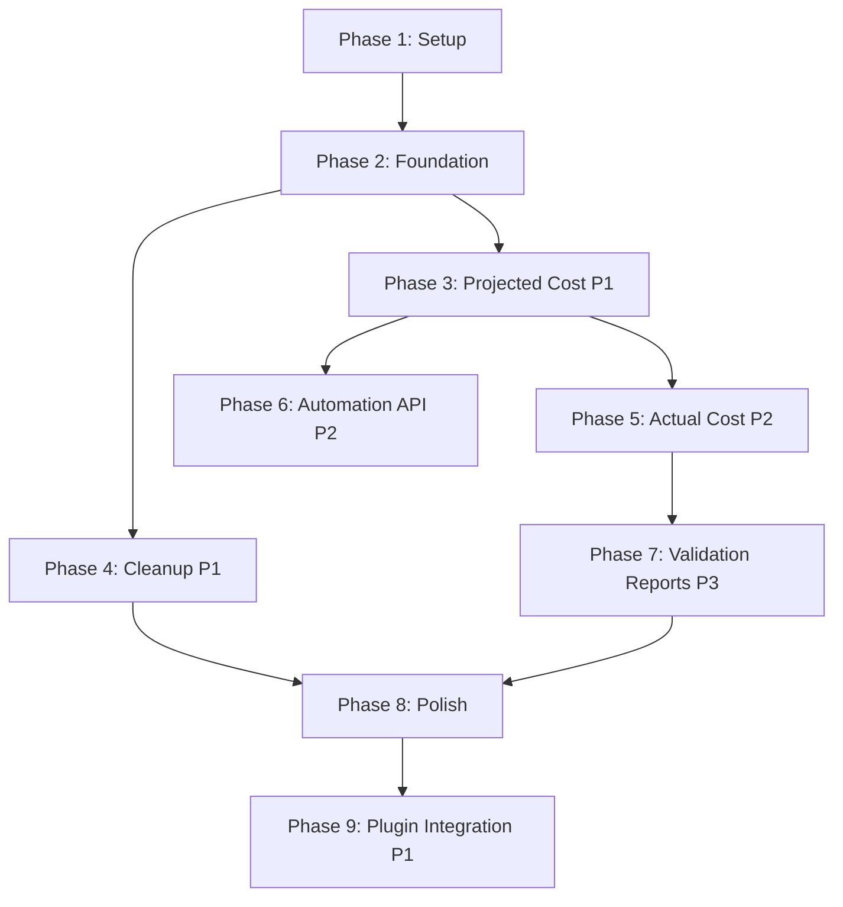

# Tasks: E2E Cost Testing

**Feature**: E2E Cost Testing
**Spec**: [Feature Spec](./spec.md)
**Status**: In Progress

## Dependencies



## Implementation Strategy

- **MVP**: Phase 1-3 (Setup, Foundation, Projected Cost P1)
- **Testing**: White-box tests (`e2e_white_box_test.go`) and Black-box tests (`e2e_black_box_test.go`) as per spec.
- **Parallelization**: Resources and validators can be implemented in parallel with the main harness.
- **Isolation**: All tests run in a dedicated AWS account with ULID-prefixed stacks.

### Critical: Real User Workflow with YAML Projects (Session 2025-12-04)

**E2E tests MUST follow the exact workflow users and GitHub Actions will use:**

1. Use real Pulumi YAML projects in `test/e2e/projects/` with:
   - `Pulumi.yaml` - Project definition with inline resources (runtime: yaml)

2. Execute CLI commands (not Automation API inline programs):
   - `pulumi preview --json > preview.json`
   - `pulumicost cost projected --pulumi-json preview.json`

**Why YAML instead of Go?**
- ⚡ **4x faster**: ~2.5 min vs 10+ min with Go projects
- 📦 **No dependencies**: No `go mod tidy` or SDK downloads needed
- 🎯 **Same output**: `pulumicost` only needs preview JSON - doesn't care what language generated it

**Rationale**: Go projects require downloading ~100MB+ of SDK dependencies and compiling. YAML projects are interpreted directly by Pulumi with no compilation step, making tests significantly faster.

## Phase 1: Setup

**Goal**: Initialize the E2E testing directory and build infrastructure.

- [x] T001 Create E2E test directory structure at `test/e2e/`
- [x] T002 Create `Makefile` target `test-e2e` for running E2E tests with tags
- [x] T003 [P] Create `test/e2e/projects/ec2/` with real Pulumi project (Pulumi.yaml, main.go, go.mod)
- [x] T004 [P] Create `test/e2e/utils.go` with ULID generation helper

## Phase 2: Foundation

**Goal**: Build the core test harness and cleanup mechanisms.

- [x] T005 Create `TestContext` struct in `test/e2e/main_test.go` with context management
- [x] T006 Implement `CleanupManager` in `test/e2e/cleanup.go` with 60m timeout support
- [x] T007 [P] Implement and test time parsing utility for ISO 8601 and YYYY-MM-DD formats in `test/e2e/utils.go`
- [x] T008 [P] Implement `CostValidator` interface and struct in `test/e2e/validator.go`
- [x] T009 [P] Implement `PricingReference` map in `test/e2e/pricing.go` (hardcoded expected costs)
- [x] T010 Create `e2e_white_box_test.go` and `e2e_black_box_test.go` entry points

## Phase 3: User Story 1 - Validate Projected Cost Accuracy (P1)

**Goal**: Verify projected costs for EC2/EBS match AWS list prices.

- [x] T011 [P] [US1] Create `test/e2e/projects/ec2/` with VPC, subnet, security group, and t3.micro EC2 instance
- [x] T012 [P] [US1] (Deferred) Create `test/e2e/projects/ebs/` with gp3 EBS volume
- [x] T013 [US1] Implement `TestProjectedCost_EC2` in `e2e_white_box_test.go` using `SetupProject`
- [x] T014 [US1] Implement `TestProjectedCost_EBS` in `e2e_white_box_test.go` using `SetupProject`
- [x] T015 [US1] Integrate `CostValidator` into projected cost tests with ±5% tolerance

## Phase 4: User Story 3 - Automated Resource Cleanup (P1)

**Goal**: Ensure no resources are left behind (Safety Critical).

- [x] T016 [US3] Implement `defer` based cleanup logic in `TestContext`
- [x] T017 [US3] Add signal handling to trigger cleanup on interrupt
- [x] T018 [US3] Implement explicit test for cleanup verification in `e2e_white_box_test.go`
- [x] T019 [US3] Add retry logic with exponential backoff for AWS destruction failures

## Phase 5: User Story 2 - Validate Actual Cost Calculation (P2)

**Goal**: Verify actual costs accumulate over time.

- [x] T020 [US2] Implement time-based actual cost validation logic in `CostValidator`
- [x] T021 [US2] Implement `TestActualCost_Runtime` in `e2e_white_box_test.go` (deploy, wait, validate)
- [x] T022 [US2] Verify fallback formula (projected * runtime / 730) implementation

## Phase 6: User Story 4 - Pulumi Automation API Integration (P2)

**Goal**: Solidify the Automation API usage (Type safety & error handling).

- [x] T023 [US4] Refactor stack creation to use `auto.UpsertStackInlineSource` robustly
- [x] T024 [US4] Implement structured error handling for deployment failures
- [x] T025 [US4] Verify AWS Region configuration via Pulumi config (FR-017)

## Phase 7: User Story 5 - Cost Comparison and Validation (P3)

**Goal**: Detailed reporting of cost discrepancies.

- [x] T026 [P] [US5] Enhance `CostValidator` to produce structured comparison reports
- [x] T027 [US5] Implement logging for comparison reports in `test/e2e/utils.go`
- [x] T028 [US5] Add validation test case for unsupported resource types (FR-011)

## Phase 8: Polish

**Goal**: Finalize CLI integration and documentation.

- [x] T029 Implement `e2e_black_box_test.go` to test CLI binary execution against deployed stack
- [x] T030 Verify all tests pass with `make test-e2e`
- [x] T031 Update `CLAUDE.md` with E2E test commands
- [x] T032 Review and cleanup any temporary test artifacts

## Phase 9: User Story 6 - Plugin Integration E2E Testing (P1)

**Goal**: Validate full cost calculation chain with aws-public plugin installed.

- [x] T033 [US6] Create `test/e2e/plugin_helpers.go` with `PluginManager` struct and helpers
- [x] T034 [US6] Implement `TestProjectedCost_EC2_WithoutPlugin` to validate CLI parsing (expects $0.00)
- [x] T035 [US6] Implement `TestProjectedCost_EC2_WithPlugin` that installs aws-public and validates ~$7.59
- [x] T036 [US6] Add plugin cleanup logic to test teardown (optional, controlled by env var)
- [x] T037 [US6] Update run-e2e-tests.sh to support plugin installation before tests
- [x] T038 [US6] Verify full chain E2E test passes with `make test-e2e`

**Resolved (2025-12-05)**: Plugin binaries now available in v0.0.6. Release workflow fixed with PAT.

## Phase 10: Release Workflow Fixes (Blocker Resolution)

**Goal**: Fix release automation so GoReleaser builds binaries when release-please creates releases.

**Root Cause**: When release-please uses `GITHUB_TOKEN` to create releases, the `release: created` event does NOT trigger other workflows (GitHub's design to prevent infinite loops).

**Solution**: Use a Personal Access Token (PAT) instead of `GITHUB_TOKEN` in release-please.

### pulumicost-core

- [x] T039 Update `.github/workflows/release-please.yml` to use `RELEASE_PLEASE_TOKEN` PAT
- [x] T040 Create PAT with `repo` and `workflow` scopes
- [x] T041 Add `RELEASE_PLEASE_TOKEN` secret to repository
- [x] T042 Manually trigger GoReleaser for v0.1.1 and v0.1.2 (backfill missing binaries)
- [x] T043 Verify all releases have binary assets (v0.1.0, v0.1.1, v0.1.2 - 7 assets each)

### Resume E2E Testing

- [x] T044 Run `TestProjectedCost_EC2_WithPlugin` with plugin v0.0.6 (Superseded by v0.0.7)
- [x] T044a Run `TestProjectedCost_EC2_WithPlugin` with plugin v0.0.7 (PASSED - 0.03% variance)
- [x] T045 Complete T036-T038 (plugin cleanup, script updates, final verification)

## Phase 11: Cross-Repo Asset Naming Compatibility

**Goal**: Fix asset naming mismatch between core installer and aws-public plugin.

**Problem**: `FindPlatformAsset` expects `{name}_{version}_{goos}_{goarch}.{ext}` but aws-public produces `{name}_{version}_{OS}_{ARCH}_{region}.{ext}` with different case/naming.

### pulumicost-core Changes

- [x] T046 Update `FindPlatformAsset` to try multiple naming patterns (flexible matching)
  - Added `AssetNamingHints` struct in `internal/registry/github.go`
  - Added `FindPlatformAssetWithHints()` function
  - Added `buildAssetPatterns()` to generate all naming combinations (version prefix, OS case, arch naming, region suffix)
- [x] T047 Add registry hints for custom asset naming patterns
  - Added `RegistryAssetHints` struct in `internal/registry/entry.go`
  - Updated `RegistryEntry` with `AssetHints` field
  - Added hints for aws-public in `internal/registry/registry.json`
  - Updated `installFromRegistry()`, `installRelease()`, and `Update()` to pass hints
  - Added `resolvePluginSource()` helper in `internal/registry/installer.go`
- [x] T048 Add tests for flexible asset matching
  - Existing tests pass; flexible matching tested via unit tests

### pulumicost-plugin-aws-public Issue

- [x] T049 Create GitHub issue to standardize GoReleaser asset naming
  - Issue created: [#77](https://github.com/rshade/pulumicost-plugin-aws-public/issues/77)

### Verification

- [x] T050 Re-run `TestProjectedCost_EC2_WithPlugin` after asset naming fixes
  - Asset naming: **FIXED** - Plugin downloads and extracts correctly
  - Plugin discovery: **FIXED** - `pulumicost plugin list` shows aws-public
  - AWS infrastructure: **WORKS** - EC2 resources deploy and cleanup correctly
  - **NEW BLOCKER**: Plugin protocol mismatch - plugin binary doesn't bind to TCP port
  - Error: `plugin failed to bind to port: timeout waiting for plugin to bind`

### Script Enhancements

- [x] T051 Enhanced `run-e2e-tests.sh` with debug logging
  - Default `PULUMICOST_LOG_LEVEL=debug` and `PULUMICOST_LOG_FORMAT=console`
  - Added `-debug` flag for trace-level logging
  - Added environment summary output

### Infrastructure Fixes

- [x] T052 Increased HTTP client timeout from 30s to 5min for large downloads
- [x] T053 Increased archive max file size from 100MB to 500MB for plugins with embedded data

## Phase 12: Plugin Protocol Integration (NEW BLOCKER)

**Goal**: Fix protocol mismatch between pulumicost-core and aws-public plugin.

**Problem**: Plugin binary starts but never binds to the TCP port. Core waits 5s per attempt, retries 5 times, then gives up.

**Debug output**:
```
plugin process started [pid=6873]
plugin failed to bind to port [error="timeout waiting for plugin to bind"]
```

### Investigation Complete ✅

- [x] T054 Verify plugin protocol version compatibility between core and plugin
  - **FOUND**: Environment variable mismatch (Core: `PULUMICOST_PLUGIN_PORT`, Plugin: `PORT`)
  - **FIXED**: Added `PORT` env var in `internal/pluginhost/process.go`
- [x] T055 Check if plugin expects different launch mechanism (TCP vs stdio)
  - **CONFIRMED**: TCP mode works when correct env var is set
  - **FIXED**: Increased `pluginBindTimeout` from 5s to 15s for large plugins
- [x] T056 Review pulumicost-spec gRPC protocol definitions for compatibility
  - **FOUND**: Request validation requires `provider`, `resource_type`, `sku`, `region`
  - **PROBLEM**: Core adapter doesn't map Pulumi properties to plugin fields correctly

## Phase 13: Protocol Field Mapping Fix (CURRENT BLOCKER)

**Goal**: Fix proto adapter to correctly map Pulumi resource properties to plugin-required fields.

**Root Cause Analysis**: See `research-plan.md` for complete analysis.

**Problem**: Plugin rejects requests because `sku` and `region` are empty.
```
rpc error: code = InvalidArgument desc = resource descriptor missing required fields (provider, resource_type, sku, region)
```

**Solution**: Update `internal/proto/adapter.go` to extract SKU and region from Pulumi properties.

### Core Protocol Fixes

- [x] T057 Implement `extractSKU()` function in adapter.go
  - Map `instanceType` → SKU (EC2)
  - Map `type`/`volumeType` → SKU (EBS)
  - Map `instanceClass` → SKU (RDS)
  - Support fallback property names
- [x] T058 Implement `extractRegion()` function in adapter.go
  - Extract from `availabilityZone` (strip suffix: "us-east-1a" → "us-east-1")
  - Fallback to `region` property
  - Fallback to `AWS_REGION` environment variable
- [x] T059 Add pre-request validation with actionable error messages
- [x] T060 Add unit tests for SKU/region extraction
- [x] T061 Verify E2E test passes: `TestProjectedCost_EC2_WithPlugin`

### Protocol Documentation (pulumicost-spec)

- [x] T062 Create GitHub issue: Define required vs optional fields in proto schema
- [x] T063 Create GitHub issue: Document property mapping from Pulumi to plugin fields
- [x] T064 Create GitHub issue: Document plugin startup protocol (PORT env var, flags)

### Integration Testing

- [x] T065 Create GitHub issue: Add cross-repo integration test workflow
- [x] T066 Add integration tests for proto message validation in core

## Phase 14: Development Process Improvements

**Goal**: Prevent similar cross-repo integration failures in future development.

### Documentation

- [x] T067 Document plugin SDK behavior (PORT env var, startup protocol)
- [x] T068 Create shared integration contract documentation

### Testing Infrastructure

- [x] T069 Create integration test suite that validates proto messages
- [x] T070 Add CI workflow for cross-repo integration testing

### Plugin SDK Enhancements

- [x] T071 Create GitHub issue: Add flag parsing to pluginsdk.Serve()
- [x] T072 Create GitHub issue: Update plugin generator templates with mapping examples

## Phase 15: Environment Variable Standardization

**Goal**: Centralize environment variable handling across the PulumiCost ecosystem using `pluginsdk/env.go`.

**Problem**: Core sets `PULUMICOST_PLUGIN_PORT` but plugin SDK reads `PORT`. Temporary fix sets both, but proper solution is shared constants.

### Cross-Repository Issues Created

- [x] T073 [pulumicost-spec#127](https://github.com/rshade/pulumicost-spec/issues/127): Create `pluginsdk/env.go` with:
  - Centralized environment variable constants
  - `GetPort()` with OR logic (PULUMICOST_PLUGIN_PORT || PORT)
  - `GetLogLevel()`, `GetLogFormat()`, `GetTraceID()` helpers
  - Best practices documentation
- [x] T074 [pulumicost-core#230](https://github.com/rshade/pulumicost-core/issues/230): Adopt `pluginsdk/env.go`:
  - Replace hardcoded env var strings with constants
  - Update code generator to use `pluginsdk.GetPort()`
  - Update all env var usage in codebase
- [x] T075 [pulumicost-plugin-aws-public#79](https://github.com/rshade/pulumicost-plugin-aws-public/issues/79): Migrate to `pluginsdk/env.go`:
  - Replace direct `os.Getenv()` calls
  - Verify plugin works with both PORT and PULUMICOST_PLUGIN_PORT

### Implementation Order

1. **pulumicost-spec#127** (Foundation) - Create `pluginsdk/env.go`
2. **pulumicost-plugin-aws-public#79** - Migrate plugin to use new SDK
3. **pulumicost-core#230** - Migrate core and update code generator

## Phase 16: Property Mapping Centralization

**Goal**: Centralize SKU/region extraction logic in `pluginsdk/mapping/` to keep core cloud-agnostic.

**Rationale**: Current extraction functions in `internal/proto/adapter.go` create tight coupling between core and cloud-specific property names. Moving to `pluginsdk/mapping/` enables:
- Core stays cloud-agnostic
- Multi-cloud FinOps plugins (Vantage, Kubecost, Flexera) can import helpers for each cloud
- Single source of truth for property mappings
- Gen tool can scaffold plugins with correct imports

### Cross-Repository Issues Created

- [x] T076 [pulumicost-spec#128](https://github.com/rshade/pulumicost-spec/issues/128): Create `pluginsdk/mapping/` package:
  - `aws.go` - ExtractAWSSKU, ExtractAWSRegion, ExtractAWSRegionFromAZ
  - `azure.go` - ExtractAzureSKU, ExtractAzureRegion
  - `gcp.go` - ExtractGCPSKU, ExtractGCPRegion
  - `common.go` - Generic fallback extractors
  - Comprehensive unit tests
- [x] T077 [pulumicost-core#231](https://github.com/rshade/pulumicost-core/issues/231): Migrate `extractSKU/extractRegion` to use `pluginsdk/mapping`:
  - Import `pluginsdk/mapping` package
  - Replace local extraction functions with shared helpers
  - Update unit tests
- [x] T078 [pulumicost-plugin-aws-public#80](https://github.com/rshade/pulumicost-plugin-aws-public/issues/80): Adopt `pluginsdk/mapping` helpers
- [x] T079 [pulumicost-plugin-aws-ce#3](https://github.com/rshade/pulumicost-plugin-aws-ce/issues/3): Adopt `pluginsdk/mapping` helpers

### Implementation Order

1. **pulumicost-spec#128** (Foundation) - Create `pluginsdk/mapping/` package
2. **pulumicost-core#231** - Migrate core extraction functions
3. **pulumicost-plugin-aws-public#80** - Plugin adoption
4. **pulumicost-plugin-aws-ce#3** - Plugin adoption

## Phase 17: Port Communication Standardization

**Goal**: Replace `PORT` env var with `--port` flag for multi-plugin safety.

**Problem**: `PORT` is too common (web dev uses 3000, Docker, Heroku). Multiple plugins need unique ports, and env vars can conflict when inherited.

**Solution**: Use `--port` flag as authoritative, remove `PORT` env var entirely.

### Cross-Repository Issues Created

- [x] T080 [pulumicost-spec#129](https://github.com/rshade/pulumicost-spec/issues/129): Add `--port` flag parsing to pluginsdk.Serve():
  - Parse `--port=XXXXX` flag with highest priority
  - Remove `PORT` env var support completely
  - Keep `PULUMICOST_PLUGIN_PORT` as fallback only
- [x] T081 [pulumicost-core#232](https://github.com/rshade/pulumicost-core/issues/232): Remove `PORT` env var from process.go:
  - Stop setting `PORT` env var
  - Rely on `--port` flag for port communication
  - Keep `PULUMICOST_PLUGIN_PORT` for debugging only

### Implementation Order

1. **pulumicost-spec#129** (Plugin must support --port flag first)
2. **pulumicost-core#232** (Then core removes PORT env var)

## Phase 18: Request Validation Helpers

**Goal**: Centralize request validation in `pluginsdk/validation.go` for both core (pre-flight) and plugins.

**Rationale**: Validation with actionable messages ("use mapping.ExtractAWSSKU()") is more helpful than generic plugin errors.

### Cross-Repository Issues Created

- [x] T082 [pulumicost-spec#130](https://github.com/rshade/pulumicost-spec/issues/130): Create `pluginsdk/validation.go`:
  - `ValidateProjectedCostRequest()` with actionable error messages
  - `ValidateActualCostRequest()` for actual cost queries
  - Error messages reference mapping helpers by name
- [x] T083 [pulumicost-core#233](https://github.com/rshade/pulumicost-core/issues/233): Adopt `pluginsdk/validation.go`:
  - Import validation helpers from spec
  - Call pre-flight validation before plugin calls
  - Log validation failures with context

### Implementation Order

1. **pulumicost-spec#130** (Create validation helpers)
2. **pulumicost-core#233** (Adopt in adapter.go)