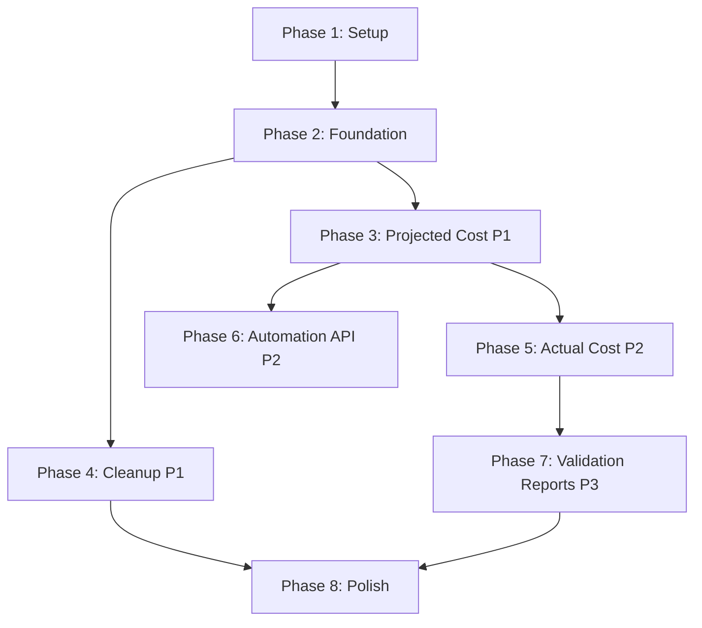

# Tasks: E2E Cost Testing

**Feature**: E2E Cost Testing
**Spec**: [Feature Spec](./spec.md)
**Status**: Pending

## Dependencies

## Implementation Strategy

- **MVP**: Phase 1-3 (Setup, Foundation, Projected Cost P1)
- **Testing**: White-box tests (`e2e_white_box_test.go`) and Black-box tests (`e2e_black_box_test.go`) as per spec.
- **Parallelization**: Resources and validators can be implemented in parallel with the main harness.
- **Isolation**: All tests run in a dedicated AWS account with ULID-prefixed stacks.

## Phase 1: Setup

**Goal**: Initialize the E2E testing directory and build infrastructure.

- [x] T001 Create E2E test directory structure at `test/e2e/`
- [x] T002 Create `Makefile` target `test-e2e` for running E2E tests with tags
- [x] T003 [P] Initialize `test/e2e/infra/aws` module for inline programs
- [x] T004 [P] Create `test/e2e/utils.go` with ULID generation helper

## Phase 2: Foundation

**Goal**: Build the core test harness and cleanup mechanisms.

- [x] T005 Create `TestContext` struct in `test/e2e/main_test.go` with context management
- [x] T006 Implement `CleanupManager` in `test/e2e/cleanup.go` with 60m timeout support
- [x] T007 [P] Implement and test time parsing utility for ISO 8601 and YYYY-MM-DD formats in `test/e2e/utils.go`
- [x] T008 [P] Implement `CostValidator` interface and struct in `test/e2e/validator.go`
- [x] T009 [P] Implement `PricingReference` map in `test/e2e/pricing.go` (hardcoded expected costs)
- [x] T010 Create `e2e_white_box_test.go` and `e2e_black_box_test.go` entry points

## Phase 3: User Story 1 - Validate Projected Cost Accuracy (P1)

**Goal**: Verify projected costs for EC2/EBS match AWS list prices.

- [x] T011 [P] [US1] Implement `t3.micro` EC2 inline program in `test/e2e/infra/aws/ec2.go`
- [x] T012 [P] [US1] Implement `gp3` EBS inline program in `test/e2e/infra/aws/ebs.go`
- [x] T013 [US1] Implement `TestProjectedCost_EC2` in `e2e_white_box_test.go`
- [x] T014 [US1] Implement `TestProjectedCost_EBS` in `e2e_white_box_test.go`
- [x] T015 [US1] Integrate `CostValidator` into projected cost tests with ±5% tolerance

## Phase 4: User Story 3 - Automated Resource Cleanup (P1)

**Goal**: Ensure no resources are left behind (Safety Critical).

- [x] T016 [US3] Implement `defer` based cleanup logic in `TestContext`
- [x] T017 [US3] Add signal handling to trigger cleanup on interrupt
- [x] T018 [US3] Implement explicit test for cleanup verification in `e2e_white_box_test.go`
- [x] T019 [US3] Add retry logic with exponential backoff for AWS destruction failures

## Phase 5: User Story 2 - Validate Actual Cost Calculation (P2)

**Goal**: Verify actual costs accumulate over time.

- [x] T020 [US2] Implement time-based actual cost validation logic in `CostValidator`
- [x] T021 [US2] Implement `TestActualCost_Runtime` in `e2e_white_box_test.go` (deploy, wait, validate)
- [x] T022 [US2] Verify fallback formula (projected * runtime / 730) implementation

## Phase 6: User Story 4 - Pulumi Automation API Integration (P2)

**Goal**: Solidify the Automation API usage (Type safety & error handling).

- [x] T023 [US4] Refactor stack creation to use `auto.UpsertStackInlineSource` robustly
- [x] T024 [US4] Implement structured error handling for deployment failures
- [x] T025 [US4] Verify AWS Region configuration via Pulumi config (FR-017)

## Phase 7: User Story 5 - Cost Comparison and Validation (P3)

**Goal**: Detailed reporting of cost discrepancies.

- [x] T026 [P] [US5] Enhance `CostValidator` to produce structured comparison reports
- [x] T027 [US5] Implement logging for comparison reports in `test/e2e/utils.go`
- [x] T028 [US5] Add validation test case for unsupported resource types (FR-011)

## Phase 8: Polish

**Goal**: Finalize CLI integration and documentation.

- [x] T029 Implement `e2e_black_box_test.go` to test CLI binary execution against deployed stack
- [ ] T030 Verify all tests pass with `make test-e2e`
- [ ] T031 Update `CLAUDE.md` with E2E test commands
- [ ] T032 Review and cleanup any temporary test artifacts
