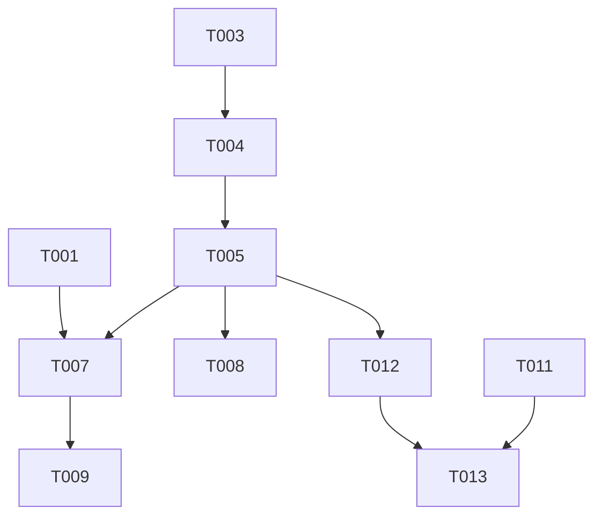

# Tasks: Pulumi Tool Plugin Integration

**Status**: Complete
**Feature Branch**: `110-pulumi-tool-plugin`
**Spec**: [spec.md](./spec.md)

## Implementation Strategy

We will implement this feature in three main increments:
1. **Foundation**: Build system updates and mode detection logic.
2. **UX Integration**: Updating the CLI help text and usage strings.
3. **Configuration**: Implementing the `PULUMI_HOME` resolution logic.

All changes should be TDD-driven, with unit tests for the detection logic and config resolution written before the implementation.

## Phase 1: Setup

*Project initialization and build system updates.*

- [x] T001 Add `build-plugin` target to `Makefile` to produce `pulumi-tool-cost` binary
- [x] T002 Update `.gitignore` to exclude `pulumi-tool-cost` binary

## Phase 2: Foundational (Blocking)

*Core logic required for all user stories.*

- [x] T003 [P] Create `internal/cli/mode.go` with `DetectPluginMode` function stub and types
- [x] T004 [P] Create `internal/cli/mode_test.go` with table-driven tests for binary name and env var detection
- [x] T005 Implement `DetectPluginMode` logic in `internal/cli/mode.go` to pass tests (FR-001, FR-002)
- [x] T006 [P] Verify `viper` configuration strictly uses `PULUMICOST` env prefix in `internal/config` (FR-005)

## Phase 3: Context-Aware Help Text (US1 & US2)

*Priority: P1 & P2 - Ensuring the tool runs and looks correct when invoked as a plugin.*

**Goal**: Users see correct usage examples when running as a plugin.

- [x] T007 [US2] Update `internal/cli/root.go` to initialize `Use` string dynamically using `DetectPluginMode` (FR-003)
- [x] T008 [US2] Update `internal/cli/root.go` to update `Example` strings based on mode (FR-004)
- [x] T009 [US2] [P] Add unit test in `internal/cli/root_test.go` verifying `Use` string changes based on mocked mode/args
- [x] T010 [US2] [P] Verify exit code logic ensures 0 for success and 1 for failure (FR-008)

## Phase 4: Configuration Path Compliance (US3)

*Priority: P2 - Respecting Pulumi ecosystem conventions.*

**Goal**: Configuration is loaded from `$PULUMI_HOME/finfocus/` if applicable.

- [x] T011 [US3] [P] Create reproduction test case in `internal/config/config_test.go` asserting `PULUMI_HOME` precedence
- [x] T012 [US3] Update `internal/config/config.go` (and/or loader logic) to check `PULUMI_HOME` env var (FR-006)
- [x] T013 [US3] Implement logic to resolve config path: `PULUMI_HOME/finfocus` > `XDG` > `HOME/.finfocus`

## Final Phase: Polish

*Documentation and cleanup.*

- [x] T014 [P] Add "Running as Pulumi Plugin" section to `docs/user-guide.md`
- [x] T015 Update `docs/installation.md` with `pulumi plugin install` instructions (if applicable) or manual install steps

## Dependencies

